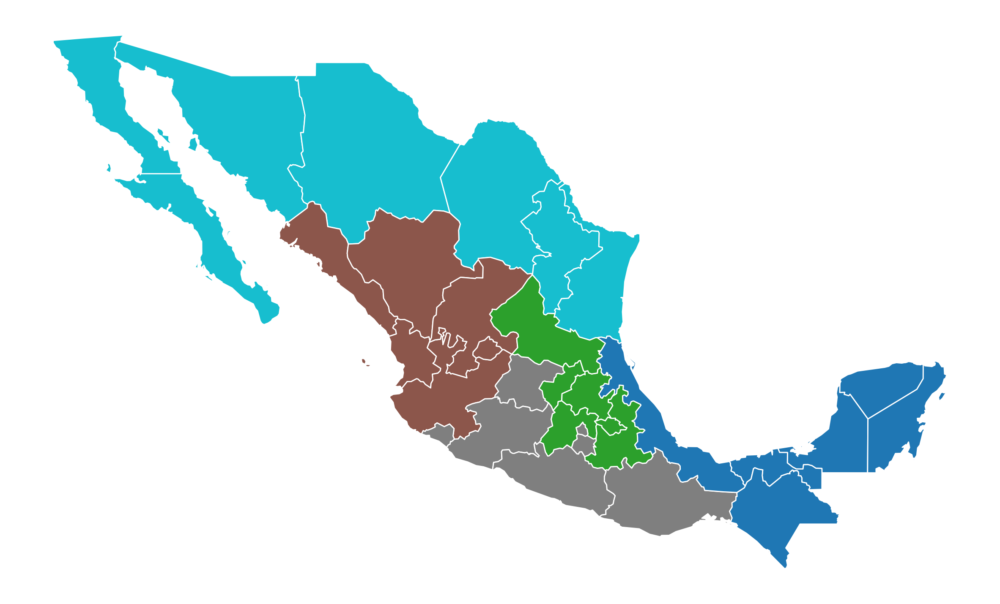
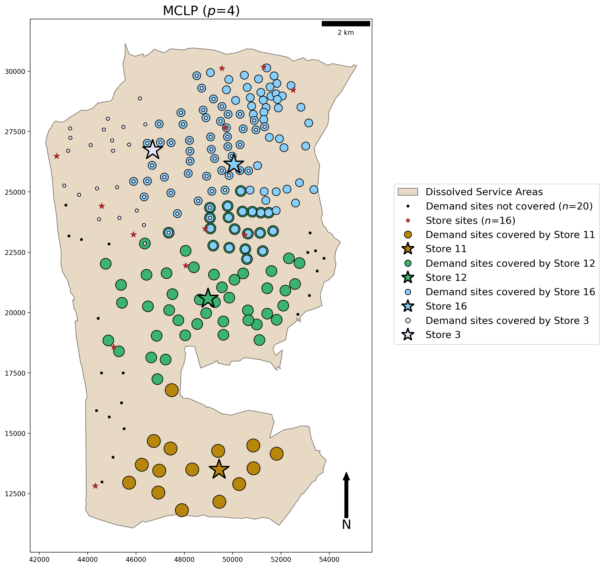

# Summary

Spatial optimization is a major spatial analytical tool in management and planning, the significance of which cannot be overstated. Spatial optimization models play an important role in designing and managing effective and efficient service systems such as transportation, education, public health, environmental protection, and commercial investment among others. To this end, spopt (\textbf{sp}atial \textbf{opt}imization) is under active development for the inclusion of newly proposed models and methods for regionalization, facility location, and transportation-oriented solutions.  Spopt is a submodule in the open-source spatial analysis library PySAL (Python Spatial Analysis Library) founded by Dr. Serge Rey and Dr. Luc Anselin in 2005 [@pysal2007;@rey2015open;@Rey2021]. The goal of developing spopt is to provide management and decision-making support to all relevant practitioners and to further promote the appropriate and meaningful application of spatial optimization models in practice.

# Statement of need

Spatial optimization methods/algorithms can be accessed in many ways. ArcGIS (https://www.esri.com/en-us/home) and TransCAD (https://www.caliper.com/) are two well-known commercial GIS software packages that provide modules designed for structuring and solving spatial optimization problems. The optimization functions they offer focus on a set classical single facility location methods (e.g., Weber, Median, Centroid, 1-center), routing and shortest path methods (e.g., shortest path on the network, least cost path over the terrain), and multi-facility location-allocation methods (e.g., coverage models, p-median problem). They are user-friendly and visually appealing, but the cost is relatively high [@murray2021contemporary]. 

Open-source software is another option to access spatial optimization. Although it may require users to have a certain level of programming experience, open-source software provides relatively novel and comprehensive methods, and more importantly, it is free and can be easily replicated. This is particularly true for regionalization and facility-location methods. Regionalization methods are limited in commercial GIS software, and may only have grouping analysis for vector data and region identification for raster data. On the contrary, there are many application-oriented open-source packages that facilitate the implementation of regionalization methods in various fields, including climate (e.g., HiClimR (https://cran.r-project.org/web/packages/HiClimR/index.html), synoptReg (https://cran.r-project.org/web/packages/synoptReg/index.html)), biography (e.g., Phyloregion (https://cran.r-project.org/web/packages/phyloregion/index.html), regioneR (http://bioconductor.org/packages/release/bioc/html/regioneR.html)), hydrology (e.g., nsRFA(https://cran.r-project.org/web/packages/nsRFA/index.html)), agricultural (e.g., OpenLCA (https://www.openlca.org/)), and so on. The functions of graph regionalization with clustering and partitioning have been provided by several packages such as Rgeoda, maxcut: Max-Cut Problem, RBGL: R Boost Graph Library, and grPartition. They are probably the most closely related projects to the regionalization section of spopt, however, they are written in R and MATLAB. For facility-location methods, commercial software such as TransCAD and ArcGIS implements models using a heuristic approach. However, they don't provide details about the solution found, which limits the interpretability of the results (Chen et al., 2021). On the other hand, existing open-source packages mostly aim at solving coverage problems such as PySpatialOpt (https://github.com/apulverizer/pyspatialopt), Allagash (https://apulverizer.github.io/allagash/) and maxcovr (https://github.com/njtierney/maxcovr), but the available models, solvers, and overall accessibility vary significantly.  Therefore, it is necessary to develop an open-source optimization package written in Python that includes various types of classic facility-location methods with a wide range of supported optimization solvers.

# Current functionality 

Originating from the region module in PySAL, spopt is under active development for the inclusion of newly proposed models and methods for regionalization and facility location. Regarding regionalization, six models are developed for aggregating a large set of geographic units (with small footprints) into a smaller number of regions (with large footprints). They are:

1. Max-p-regions: the clustering of a set of geographic areas into the maximum number of homogeneous and spatially contiguous regions such that the value of a spatially extensive regional attribute is above a predefined threshold [@duque2012max;@wei2020efficient].
2. Spatially-encouraged spectral clustering (spenc): an algorithm to balance spatial and feature coherence using kernel combination in spectral clustering [@wolf2020].
3. Region-K-means: K-means clustering for regions with the constraint that each cluster forms a spatially connected component.
4. Automatic Zoning Procedure (AZP): the aggregation of data for a larger number of zones into a prespecified smaller number of regions based on a predefined type of objective function [@openshaw1977geographical;@openshaw1995algorithms].
5. Skater: a constrained spatial regionalization algorithm based on spanning tree pruning. Specifically, the number of edges is prespecified to be cut in a continuous tree to group spatial units into contiguous regions [@assunccao2006efficient].
6. WardSpatial: an agglomerative clustering (each observation starts in its own cluster, and pairs of clusters are chosen to merge at each step) using ward linkage (the goal is to minimize the variance of the clusters) with a spatial connectivity constraint ([sklearn.cluster.AgglomerativeClustering](sklearn.cluster.AgglomerativeClustering: https://scikit-learn.org/stable/modules/generated/sklearn.cluster.AgglomerativeClustering.html)).

Take the functionality of Max-p-regions as an example. Other methods can be applied in a similar process, including importing the needed packages, imputing and reading data, defining the parameters, solving the model, and plotting the solution. 

```python
from spopt.region import MaxPHeuristic as MaxP
import geopandas, libpysal
# Read in the data on regional incomes for Mexican states.
mexico = geopandas.read_file(libpysal.examples.get_path("mexicojoin.shp"))
# Specify parameters for the Max-p-regions model.
# Details can be found at https://pysal.org/spopt/notebooks/maxp.html.
attrs_name = [f"PCGDP{2000}"]
w = libpysal.weights.Queen.from_dataframe(mexico)
threshold_name, threshold, top_n, mexico["count"] = "count", 6, 2, 1
# Solve the Max-p-regions model.
model = MaxP(mexico, w, attrs_name, threshold_name, threshold, top_n)
model.solve()
# Plot the model solution.
mexico["maxp_new"] = model.labels_
mexico.plot(column="maxp_new", categorical=True, edgecolor="w");
```

The corresponding solution of Max-p-regions running the above code is shown in \autoref{fig: maxp}.
It results in five regions, three of which have six states, and two with seven states each. Each region is a spatially connected component, as required by the Max-p-regions problem.



For facility-location, four models, including two coverage models and two location-allocation models based on median and center problems, are developed using an exact approach.

1. Location Set Covering Problem (LSCP): Finding the minimum number of facilities and their locations such that all demands are covered within the maximal distance or time standard [@Toregas1971].
2. Maximal Covering Location Problem (MCLP): Locating a prespecified number of facilities such that demand coverage within a maximal service distance or time is maximized [@Church1974].
3. P-Median Problem: Locating \textit{p} facilities and allocating the demand served by these facilities so that the total weighted assignment distance or time is minimized [@ReVelle1970]. 
4. P-Center Problem: Locating \textit{p} facilities and allocating the demand served by these facilities to minimize the maximum assignment distance or time between demands and their allocated facilities [@Hakimi1964].

For example, Maximal Covering Location Model functionality is used to select 4 facilities out of 16 store sites along census tracts belonging to San Francisco, as shown in \autoref{fig: mclp}. Other facility-location methods can be applied in a similar way.

```python
from spopt.locate.coverage import MCLP
import geopandas, numpy, pandas, pulp
# Read in the datasets 
ntw_dist = pandas.read_csv("SF_network_distance_candidateStore_16_censusTract_205_new.csv")
demand_points = pandas.read_csv("SF_demand_205_centroid_uniform_weight.csv", index_col=0)
facility_points = pandas.read_csv("SF_store_site_16_longlat.csv", index_col=0)
tract = geopandas.read_file("ServiceAreas_4.shp")
# Create a store site to tract centroid distance matrix
ntw_piv = ntw_dist.pivot_table(values="distance", index="DestinationName", columns="name")
cost_matrix = ntw_piv.to_numpy()
ai = demand_points["POP2000"].to_numpy()
mclp = MCLP.from_cost_matrix(cost_matrix, ai, max_coverage=5000, p_facilities=4)
mclp = mclp.solve(pulp.GLPK(msg=False))
# Build a facility-demand array for the demand covered by each facility and plot results
mclp.facility_client_array()
facility_points_gdf = geopandas.GeoDataFrame(facility_points,
    geometry=geopandas.points_from_xy(facility_points.long, facility_points.lat),
).sort_values(by=["NAME"]).reset_index()
demand_points_gdf = geopandas.GeoDataFrame(demand_points,
    geometry=geopandas.points_from_xy(demand_points.long, demand_points.lat),
).sort_values(by=["NAME"]).reset_index()
plot_results(mclp, facility_points_gdf, demand_points_gdf, facility_gdf_shape[0], "MCLP")
```



# Planned Enhancements

Spopt is under active development and the spopt developers look forward to your extensive attention and participation. In the near future, there are three major enhancements we plan to pursue for spopt:

1. The first stream will be on the enhancement of regionalization algorithms by including several novel extensions of the classical regionalization models, such as the integration of spatial data uncertainty and the shape of identified regions in the max-p-regions problem.
2. The second direction involves adding capacity constraints and includes a polygon partial coverage on facility location models. No commercial and open-source software has provided these features before.
3. We anticipate adding functionality for solving traditional routing and transportation-oriented optimization problems. Initially, this will come in the form of integer programming formulations of the Travelling Salesperson Problem [@miller1960integer] and the Transportation Problem [@koopmans1949optimum].

# Acknowledgements
We would like to thank all the contributors to this package. Besides, we would like to extend our gratitude to all the users for inspiring and questioning this package to make it better. Spopt development was partially supported by National Science Foundation Award #1831615 RIDIR: Scalable Geospatial Analytics for Social Science Research. 

# References
